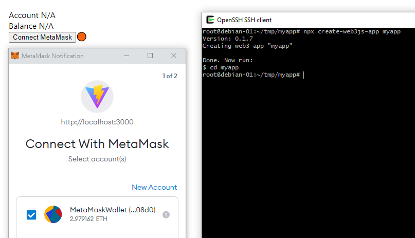

# Create Web3js App

Command line to create a Web3 App. Features:
- Frontend: React, Typescript, Web3-React, Metamask, Vitejs (dev mode < 1s).
- Backend: NodeJS [vercel-express](https://github.com/ngduc/vercel-express)
- Solidity: Smart contracts using Hardhat.
- Deploy using Vercel with no cost.

## Usage

```
$ npx create-web3js-app appname
```



## Contribution

- If something doesn't work, please [file an issue](https://github.com/coddx-hq/create-web3js-app/issues).
- All contributions are welcome! Please use Github Pull Request. See [TODO.md](TODO.md)
